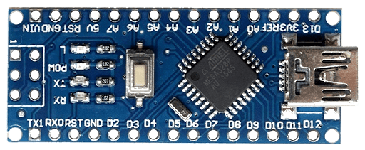

# libch340
> read/write to ch340 device without tty driver




___

### why?
You bought an off brand arduino and realize that it comes with a ch340 instead of ftdi. Can't find arm64 binary for tty driver? Use lib-ch340 to easily read/write to your microcontroller from any linux host.

### development

```bash
make build # locally builds static and dynamic target
```

```bash
TARGET=amd64 make build-docker # builds x86 targets in docker
```

```bash
TARGET=arm64 make build-docker # builds arm64 targets in docker
```

```bash
TARGET=[amd64|arm64] make sync # copies build to local fs
```

### test

Run `lsusb` to find vendor and product id for ch340 device. Look for description such as:

```
Bus 003 Device 072: ID 1a86:7523 QinHeng Electronics HL-340 USB-Serial adapte
```

Run test script with vendor and prouct:

```
./build/tests/test_ch340 1a86 7523
```
